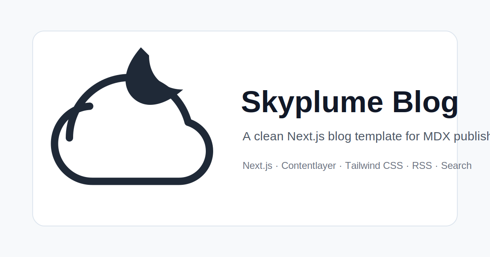

<p align="center">
  <picture>
    <source media="(prefers-color-scheme: dark)" srcset="public/static/images/logo-dark.svg">
    
  </picture>
</p>

<p align="center">
  A refined, content-first Next.js blog template for personal publishing,<br/>engineering notes, project journals, and long-form MDX writing.
</p>

<p align="center">
  <a href="https://github.com/ruoduan-hub/next-blog-skyplume-template/stargazers">
    
  </a>
  <a href="./LICENSE">
    
  </a>
  <a href="https://github.com/ruoduan-hub/next-blog-skyplume-template">
    
  </a>
  <br/>
  
  
  
  
  
  
  <a href="https://www.0x1ai.com/">
    
  </a>
</p>

<p align="center">
  <a href="https://vercel.com/new/clone?repository-url=https%3A%2F%2Fgithub.com%2Fruoduan-hub%2Fnext-blog-skyplume-template&project-name=skyplume-blog&repository-name=skyplume-blog">
    
  </a>
  <a href="https://github.com/ruoduan-hub/next-blog-skyplume-template/generate">
    
  </a>
</p>

<p align="center">
  <a href="#quick-start">Quick Start</a> ·
  <a href="#highlights">Highlights</a> ·
  <a href="#configure-your-site">Configure</a> ·
  <a href="#write-posts">Write</a> ·
  <a href="#deploy-to-vercel">Deploy</a> ·
  <a href="./README.zh-CN.md">简体中文</a>
</p>

---


---

## Why Skyplume

Skyplume is extracted from [Ruoduan](https://www.0x1ai.com/)'s personal blog at [0x1ai.com](https://www.0x1ai.com/) — a production site written, maintained, and tuned over years of real-world use. It keeps what matters for serious personal publishing:

- **Writing experience.** MDX-first with front matter, reading time, table of contents, math, citations, code highlighting, and custom components.
- **Search visibility.** Complete SEO stack — metadata, Open Graph, Twitter cards, JSON-LD, sitemap, robots.txt, RSS.
- **Reading comfort.** Restrained typography, quiet color palette, dark mode, fast page transitions.
- **Developer ownership.** Plain data files and small React components. No CMS lock-in. No hidden configuration layers.

---

## Highlights

| | |
| --- | --- |
| **Framework** | Next.js 15 App Router, React 19, TypeScript, Tailwind CSS 4, Contentlayer 2 |
| **Authoring** | MDX, KaTeX math, citations, code titles + highlighting, heading anchors, GitHub alerts |
| **SEO** | Open Graph, Twitter cards, JSON-LD `BlogPosting`, canonical URLs, sitemap, robots.txt, RSS |
| **Discovery** | Build-time local search index, tag pages, structured archives, RSS feed |
| **Reading** | Dark mode, responsive layout, reading time, table of contents, previous/next navigation |
| **Motion** | Route transitions, staggered hero, scroll reveal, feed animations, progress bar |
| **Performance** | Static generation, optimized font loading, long-term asset caching, static export support |
| **Security** | CSP, referrer policy, HSTS, frame protection, content-type headers |
| **Lighthouse** | Baseline template tuned to **100 Performance / 100 Best Practices / 100 SEO** |


---

## Design Principles

Skyplume is designed for **reading before decoration**. The interface uses restrained spacing, sharp typography, and quiet borders so writing stays front and center. Motion is intentionally short and lightweight — polish without distraction.

**Mineral Teal palette.** A low-chroma, lab-grade teal paired with teal-tinted neutrals. Grays carry body text and metadata without visual noise. The primary color is reserved for links, focus states, and interactive cues. In dark mode, deep teal-gray backgrounds keep long-form reading stable.

The template is meant to be **owned**, not just used. Most customization starts in plain data files and MDX — not a hidden admin panel.

---

## Quick Start

```bash
yarn install
yarn dev
```

Open [http://localhost:3000](http://localhost:3000).

### Available Scripts

```bash
yarn dev       # Start development server
yarn build     # Production build + RSS generation
yarn serve     # Serve production build locally
yarn analyze   # Bundle analyzer
yarn lint      # Lint app, components, layouts, and scripts
```

### Static Export

```bash
EXPORT=true UNOPTIMIZED=true yarn build
```

Set `BASE_PATH` when deploying under a subpath.

---

## Configure Your Site

Edit these files first — everything is self-documenting:

| File | Purpose |
| --- | --- |
| `data/siteMetadata.js` | Title, URL, author, SEO defaults, search, comments |
| `data/profile.ts` | About page: bio, links, skills |
| `data/authors/default.mdx` | Default author metadata |
| `data/headerNavLinks.ts` | Top navigation links |
| `data/projectsData.ts` | Projects page content |
| `public/static/images/skyplume-card.svg` | Social sharing card |
| `public/static/favicons/favicon.svg` | Browser favicon |

### Comments (Giscus)

Copy `.env.example` to `.env.local` and fill in your Giscus values. To disable comments entirely, set `comments.provider` to `""` in `data/siteMetadata.js`.

---

## Write Posts

Create MDX files in `data/blog`:

```mdx
---
title: My First Post
date: '2026-01-01'
tags:
  - nextjs
  - writing
categories:
  - notes
draft: false
summary: A short description for feeds, cards, and SEO.
authors:
  - default
---

Write your post in MDX.
```

Place images under `public/static/blog/<post-slug>` and reference them:

```mdx

```

A sample post is included at `data/blog/term-proxy.mdx`.

---

## Deploy to Vercel

Click the deploy button above. The template boots without newsletter, analytics, or comment credentials — everything is optional.

---

## Project Structure

```
app/                 App Router pages, metadata, sitemap, robots
components/          Shared UI, MDX components, search, theme, motion
data/                Site metadata, authors, profile, projects, blog posts
layouts/             Blog post and list page layouts
public/static/       Images, favicons, post assets
scripts/             RSS and post-build utilities
css/                 Tailwind, syntax highlighting, animations
```

---

## Recommend to Vercel

Skyplume fits the Vercel template community:

- **Category:** Blog, Next.js, Tailwind CSS, MDX
- **Repository:** [ruoduan-hub/next-blog-skyplume-template](https://github.com/ruoduan-hub/next-blog-skyplume-template)
- **Production reference:** [0x1ai.com](https://www.0x1ai.com/)

> Skyplume is a refined Next.js 15 blog template extracted from a production personal site. It ships with MDX publishing, Contentlayer, Tailwind CSS 4, local search, RSS, sitemap, JSON-LD, Open Graph defaults, dark mode, Giscus comments, static export support, security headers, and a baseline Lighthouse 100/100/100 setup for Performance, Best Practices, and SEO.

---

## Credits

Derived from the blog system powering [0x1ai.com](https://www.0x1ai.com/), built and maintained by [Ruoduan](https://www.0x1ai.com/).

## License

MIT — use, modify, and ship it.
